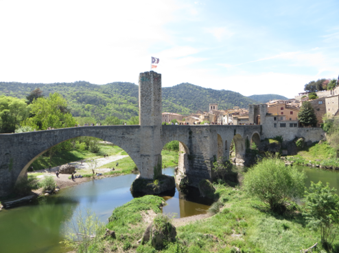
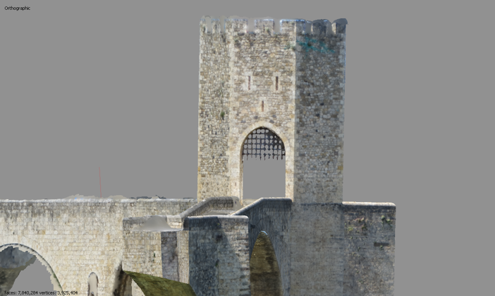
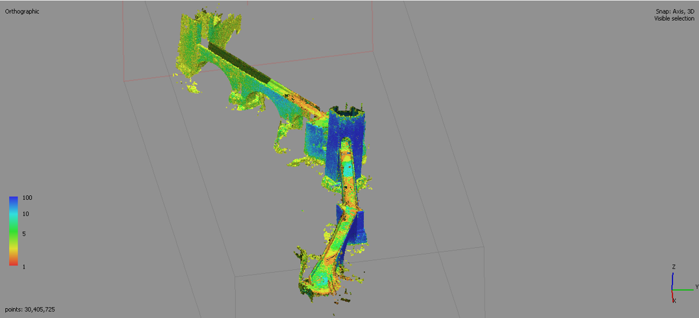
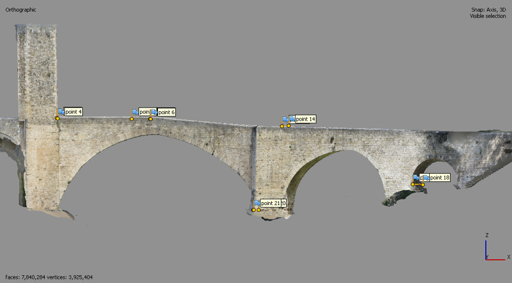

Besalu is a project made in the last year of my bachelor degree in Geoinformation and Geomatics. 
The project consists in the creation of a 3D Model of the medieval bridge in the town of Besalu.

The 3D Model was done with photogrammetry, using a digital cammera and the software Agisoft Metashape. 

Here there are some images of the final product. 

