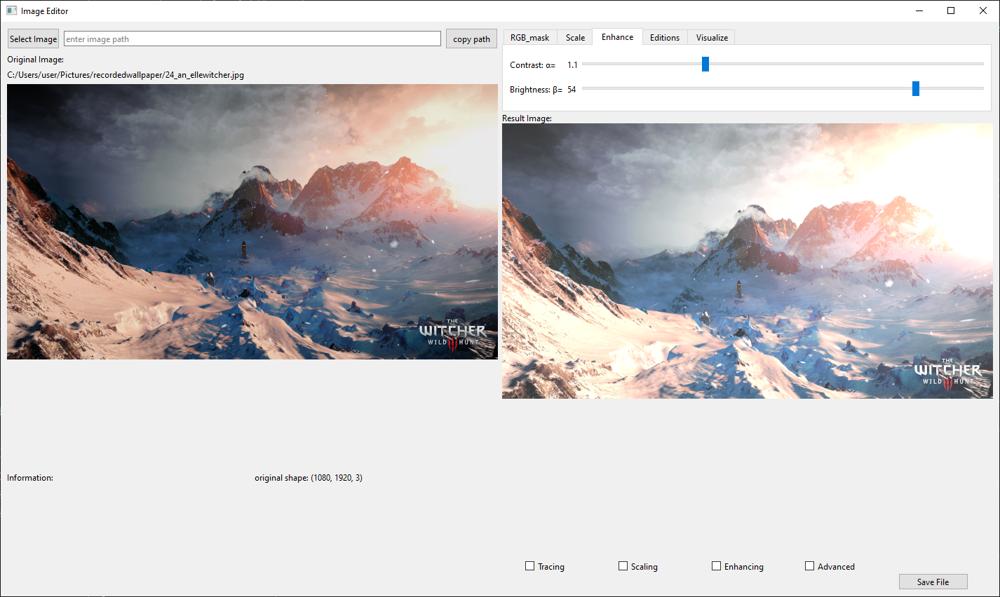

## EDIMA
Edima is a project of image edition, "EDIition IMAges", where I build a PyQT6 interface that can edit images. 

In this project I've wanted to build an interactive interface with python, as a way to apply the theory I learned over image edition into a usable project.

### GUI_Imagery 
GUI_Imagery is the main program that must be executed to see the python interface. Inside there is the whole structure of the pyQT interface.
If you run the file, the program will automatically open and then you can already interact with it.

The other python files are fragments of the main code, specialized in a concrete edition, for example, the adaptation of brightness and contrast. These secondary files are code snippets that serve as a test before applying the complete version into the interface. 

### Libraries and resources Installation
General libraries used:
  - os, sys, pyperclip
  - PyQt6 &emsp; &emsp; &emsp; &emsp; *pip install pyQt6*
  - matplotlib.pyplot
  - numpy
Image edition libraries used: 
  - opencv &emsp; &emsp; &emsp; *pip install opencv-python*
  - PIL &emsp; &emsp; &emsp; &emsp;  *pip install PIL*

**for pip installations, in case pip install <module> doesn't work, do >. py -3 -m pip install <module>**
**for conda environment installations, in the terminal run >. conda install <module>**
**there's an option to install all the libraries with the requirements.txt <pip install -r requirements.txt>**
